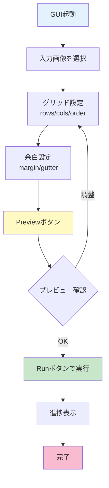
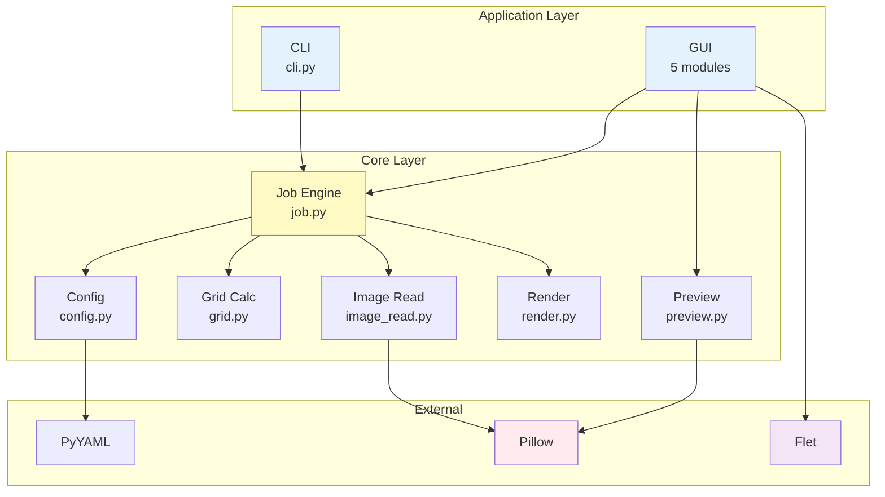

# csp-name-splitter

<div align="center">

**CSPネーム分割ツール**

CSPで作成した俯瞰ネーム画像を自動分割し、<br>
複数ページPNG群として出力するツール

[](https://github.com/yourusername/csp-name-splitter/releases)
[](https://www.python.org/downloads/)
[](LICENSE)

</div>

---

## 📑 目次

- [概要](#-概要)
- [特徴](#-特徴)
- [クイックスタート](#-クイックスタート)
- [インストール](#-インストール)
  - [Windows ユーザー向け（推奨）](#windows-ユーザー向け推奨)
  - [基本インストール（開発者向け）](#基本インストール開発者向け)
- [使い方](#-使い方)
  - [GUI モード](#gui-モード)
  - [CLI モード](#cli-モード)
  - [設定ファイル](#設定ファイル)
- [トラブルシューティング](#-トラブルシューティング)
- [FAQ](#-faq)
- [開発者向け情報](#-開発者向け情報)
  - [開発環境のセットアップ](#開発環境のセットアップ)
  - [プロジェクト構造](#プロジェクト構造)
  - [アーキテクチャ](#アーキテクチャ)
  - [テスト](#テスト)
  - [コントリビューション](#コントリビューション)
- [技術仕様](#-技術仕様)
- [ライセンス](#-ライセンス)

---

## 🎯 概要

**csp-name-splitter**は、CLIP STUDIO PAINT（CSP）で作成した「俯瞰ネーム」（複数ページを1枚の画像にまとめたもの）を、ページごとの個別PNG画像に自動分割するツールです。

### 想定ワークフロー


### 主な用途

- **16ページ俯瞰ネーム**（4×4グリッド）を個別ページに分割
- **CSP EX**で複数ページ作品として一括取り込み
- ページ順序やマージン・ガッター（余白）を柔軟に設定可能

---

## ✨ 特徴

- ✅ **Photoshop不要** - Pythonと軽量ライブラリのみで動作
- 🖼️ **大判対応** - B3見開き600dpi（約17k×12k px）までサポート
- 🎨 **GUI/CLI両対応** - 視覚的な確認も、自動化も可能
- 📐 **柔軟なグリッド設定** - 行列数、読み順、余白を自由に調整
- 📊 **プレビュー機能** - 分割結果を事前確認（ページ番号表示・ズーム対応）
- 📂 **バッチ処理対応** - フォルダ内の画像を一括処理（Batch タブ）
- 🔔 **完了後の自動オープン** - 処理完了後に出力フォルダを自動で開く・タスクバー通知（Windows）
- 🌐 **日本語エラー対応** - エラーメッセージが日本語で表示され、原因をすぐ把握
- 🎉 **初回起動ガイダンス** - はじめての方向けのウェルカムガイダンス表示
- 🚀 **軽量・高速** - シンプルな画像処理で素早く分割

### 設計方針

- `.clip`ファイルの直接生成・編集は行わない
- テキストはラスタ化（編集可能性は維持しない）
- レイヤー構造は扱わず、単一画像として分割
- 配布可能なスタンドアロンツール

---

## 🚀 クイックスタート

### 最速で試す（GUI使用）

```bash
# 1. インストール
pip install -e .
pip install flet  # GUI用

# 2. GUI起動
python -m name_splitter.app.cli --gui

# 3. GUIで画像を選択 → プレビュー → 実行！
```

### コマンドで実行（CLI使用）

```bash
# デフォルト設定で分割（4×4グリッド、右→左・上→下）
python -m name_splitter.app.cli input.png

# 出力先指定
python -m name_splitter.app.cli input.png --out-dir ./output

# 設定ファイル使用
python -m name_splitter.app.cli input.png --config my_config.yaml

# 1ページだけテスト出力
python -m name_splitter.app.cli input.png --page 1
```

---

## 📦 インストール

### Windows ユーザー向け（推奨）

**Python のインストールは不要です。** 配布用の実行ファイルを使用してください。

1. [GitHub Releases](https://github.com/yourusername/csp-name-splitter/releases/latest) から最新の `CSP-Name-Splitter-vX.X.X.zip` をダウンロード
2. ZIP を任意のフォルダに展開
3. `CSP-Name-Splitter.exe` をダブルクリックして起動

> **注意**: Windows Defender のスマートスクリーンが警告を表示する場合は、「詳細情報」→「実行」を選択してください。

### 基本インストール（開発者向け）

### 必須要件

- **Python 3.10以上**
- **Pillow** (PNG読み書き)
- **PyYAML** (設定ファイル)

### 基本インストール

```bash
# リポジトリをクローン
git clone https://github.com/yourusername/csp-name-splitter.git
cd csp-name-splitter

# 依存関係をインストール
pip install -e .
```

### GUI機能を使う場合

```bash
# Fletを追加インストール
pip install flet
```

### 開発環境（テスト含む）

```bash
# 開発用依存関係も含めてインストール
pip install -e ".[gui,test]"
```

---

## 📖 使い方

### GUI モード

視覚的にプレビューしながら設定を調整できます。

```bash
python -m name_splitter.app.cli --gui
```

<!-- TODO: GUI 完成後にスクリーンショットを撮影して配置 -->


#### GUI操作フロー



#### GUI機能一覧

| 機能 | 説明 |
|------|------|
| **画像選択** | PNG/JPEG画像を読み込み |
| **グリッド設定** | 行数・列数・読み順を指定 |
| **余白設定** | マージン・ガッター（単位: px/mm） |
| **プレビュー** | 分割線とページ番号を表示（ズーム・パン対応） |
| **テストページ** | 指定ページのみ出力して確認 |
| **実行** | 全ページを分割出力 |
| **進捗表示** | リアルタイム進捗バー |
| **キャンセル** | 処理を中断 |
| **バッチ処理** | フォルダ内の複数画像を一括処理（Batch タブ） |
| **自動フォルダオープン** | 完了後に出力フォルダを自動で開く |

### CLI モード

スクリプトやバッチ処理に最適です。

```bash
# 基本形式
python -m name_splitter.app.cli <入力画像> [オプション]
```

#### オプション一覧

| オプション | 説明 | 例 |
|-----------|------|-----|
| `--config` | 設定ファイルを指定 | `--config custom.yaml` |
| `--out-dir` | 出力ディレクトリ | `--out-dir ./pages` |
| `--page N` | N番目のページのみ出力（1始まり） | `--page 5` |
| `--gui` | GUIモードで起動 | `--gui` |

#### 実行例

```bash
# 例1: デフォルト設定で分割
python -m name_splitter.app.cli name_16pages.png

# 例2: カスタム設定 + 出力先指定
python -m name_splitter.app.cli name_16pages.png \
  --config config_a4.yaml \
  --out-dir ./output/chapter1

# 例3: 3ページ目だけテスト出力
python -m name_splitter.app.cli name_16pages.png --page 3
```

### 設定ファイル

`config.yaml` で詳細な設定が可能です。

```yaml
version: 1

input:
  image_path: ""  # CLIで上書き可能

grid:
  rows: 4         # 行数
  cols: 4         # 列数
  order: rtl_ttb  # 読み順: rtl_ttb（右→左・上→下） or ltr_ttb（左→右・上→下）
  margin:
    value: 0      # 外周マージン
    unit: px      # 単位: px / mm
  gutter:
    value: 0      # セル間ガッター
    unit: px      # 単位: px / mm

output:
  out_dir: "./output"              # 出力ディレクトリ
  page_basename: "page_{page:03d}" # ファイル名書式（page_001.png など）
  raster_ext: "png"                # 出力形式

limits:
  max_dim_px: 30000  # 最大画像サイズ（px）
  on_exceed: "error" # 超過時の動作: error / warn
```

#### 読み順の指定

| 値 | 意味 |
|----|------|
| `rtl_ttb` | 右→左、上→下（日本の漫画形式） |
| `ltr_ttb` | 左→右、上→下（欧米のコミック形式） |

#### マージン・ガッターの例

```yaml
# ケース1: ピクセル指定（600dpi想定で約1mm = 24px）
grid:
  margin:
    value: 24
    unit: px
  gutter:
    value: 12
    unit: px

# ケース2: mm指定（DPI情報がある場合自動計算）
grid:
  margin:
    value: 5
    unit: mm
  gutter:
    value: 2
    unit: mm
```

---

## 🔧 トラブルシューティング

### よくあるエラー

#### `LimitExceededError: Image dimensions exceed limit`

**原因**: 画像サイズが30000×30000pxを超えている

**解決策**:
1. CSP側で解像度を下げて再出力（例: 600dpi → 300dpi）
2. または設定で上限を引き上げ（推奨しません）

```yaml
limits:
  max_dim_px: 40000  # 上限変更（メモリ消費に注意）
```

#### `ImageReadError: Cannot read image`

**原因**: 画像ファイルの破損、または対応形式外

**解決策**:
- CSPから再出力（PNG推奨）
- Pillowが未インストールなら `pip install Pillow`

#### `GUI起動失敗`

**原因**: Fletが未インストール、または環境依存のエラー

**解決策**:
```bash
pip install flet --upgrade
```

#### `出力ページ数が想定と違う`

**原因**: グリッド設定（rows/cols）が間違っている

**解決策**:
- 4×4=16ページなら `rows: 4, cols: 4`
- 2×8=16ページなら `rows: 2, cols: 8`

### デバッグ方法

```bash
# 1ページだけ出力して確認
python -m name_splitter.app.cli input.png --page 1

# 設定ファイルの検証
python -c "from name_splitter.core import load_config; load_config('config.yaml')"
```

---

## ❓ FAQ

<details>
<summary><strong>Q1: CSP以外のツールで作成した画像も分割できますか？</strong></summary>

**A**: はい。PNG/JPEG形式であればどんなツールで作成した画像でも分割可能です。
</details>

<details>
<summary><strong>Q2: レイヤー情報を保持したままページ分割できますか？</strong></summary>

**A**: いいえ。本ツールは単一画像を分割するため、レイヤー情報は保持されません（ラスタライズされます）。
</details>

<details>
<summary><strong>Q3: 不均等なグリッド（ページサイズが異なる）に対応していますか？</strong></summary>

**A**: 現在は均等分割のみ対応しています。すべてのセルが同じサイズになります。
</details>

<details>
<summary><strong>Q4: 出力形式をPNG以外に変更できますか？</strong></summary>

**A**: 設定ファイルで `raster_ext: "jpg"` などに変更可能です。ただしPNGを推奨します（透明度保持）。
</details>

<details>
<summary><strong>Q5: マージンとガッターの違いは？</strong></summary>

**A**:
- **マージン**: 画像全体の外周余白
- **ガッター**: セル間（ページ間）の余白

```
┌────────マージン────────┐
│  ┌─┬─┬─┐ ガッター  │
│  │1│2│3│      ↓      │
│  ├─┼─┼─┤            │
│  │4│5│6│            │
│  └─┴─┴─┘            │
└──────────────────────┘
```
</details>

---

## 👨‍💻 開発者向け情報

### 開発環境のセットアップ

```bash
# 1. リポジトリをクローン
git clone https://github.com/yourusername/csp-name-splitter.git
cd csp-name-splitter

# 2. 仮想環境作成（推奨）
python -m venv .venv
source .venv/bin/activate  # Windows: .venv\Scripts\activate

# 3. 開発用インストール
pip install -e ".[gui,test]"

# 4. テスト実行
pytest tests/

# 5. テスト環境生成
python tools/create_test_env.py
```

### プロジェクト構造

```
csp-name-splitter/
├── name_splitter/           # メインパッケージ
│   ├── app/                 # アプリケーション層
│   │   ├── cli.py           # CLIエントリーポイント
│   │   ├── main.py          # 配布用エントリーポイント（exe化対応）
│   │   ├── gui.py           # GUI実装（Flet）
│   │   ├── gui_handlers.py  # GUIイベントハンドラ統合クラス
│   │   ├── gui_handlers_batch.py  # バッチ処理GUIMixin
│   │   ├── gui_handlers_config.py # コンフィグ読み込みMixin
│   │   ├── gui_handlers_size.py   # サイズ計算Mixin
│   │   ├── gui_types.py     # 型定義・Protocol
│   │   ├── gui_state.py     # 状態管理
│   │   ├── gui_utils.py     # GUI補助関数
│   │   ├── gui_widgets.py   # ウィジェット生成
│   │   ├── gui_widgets_layout.py  # レイアウト構築
│   │   ├── app_settings.py  # 設定永続化（ウィンドウサイズ・テーマ等）
│   │   └── error_messages.py      # GUIエラーメッセージ日本語化辞書
│   └── core/                # コアロジック
│       ├── job.py           # ジョブ実行エンジン
│       ├── config.py        # 設定管理
│       ├── grid.py          # グリッド計算
│       ├── image_read.py    # 画像読み込み
│       ├── render.py        # ページレンダリング
│       ├── preview.py       # プレビュー生成
│       ├── merge.py         # レイヤーマージ
│       ├── image_ops.py     # 画像操作ユーティリティ
│       ├── template.py      # テンプレート処理
│       ├── batch.py         # バッチ処理エンジン
│       └── errors.py        # 例外定義
├── resources/               # リソースファイル
│   └── default_config.yaml  # デフォルト設定
├── docs/                    # ドキュメント
│   ├── architecture/        # アーキテクチャドキュメント
│   └── screenshots/         # スクリーンショット
├── tests/                   # 単体テスト
├── tools/                   # 開発ツール
│   ├── create_test_env.py   # テスト環境生成
│   └── run_smoke_test.py    # スモークテスト
├── test_env/                # テストデータ（生成）
├── pyproject.toml           # プロジェクト設定
└── README.md                # このファイル
```

### アーキテクチャ

詳細なアーキテクチャドキュメントは **[ARCHITECTURE.md](ARCHITECTURE.md)** を参照してください。

#### 概要



**主要な設計原則**:
- 関心の分離 (UI / ビジネスロジック / データ)
- Protocol型による型安全性
- 依存性注入
- 単一責任原則

詳細は [ARCHITECTURE.md](ARCHITECTURE.md) を参照してください。

### テスト

#### 単体テスト実行

```bash
# 全テスト実行
pytest tests/

# 特定のテスト実行
pytest tests/test_grid.py

# カバレッジ付き
pytest --cov=name_splitter tests/
```

#### 統合テスト

```bash
# テスト環境生成
python tools/create_test_env.py

# スモークテスト
python tools/run_smoke_test.py

# 個別機能テスト
python test_config_fields.py
python test_page_size.py
python test_margin_unit.py
python test_gutter_unit.py
python test_preview.py
```

#### テストファイル一覧

| ファイル | 内容 |
|---------|------|
| `tests/test_grid.py` | グリッド計算ロジック |
| `tests/test_config.py` | 設定ロード・バリデーション |
| `tests/test_render.py` | レンダリング処理 |
| `tests/test_image_ops.py` | 画像操作ユーティリティ |
| `tests/test_merge.py` | レイヤーマージ |
| `test_preview.py` | プレビュー生成 |

### コントリビューション

#### 貢献方法

1. **Issue報告**: バグ報告や機能要望は[Issues](https://github.com/yourusername/csp-name-splitter/issues)へ
2. **Pull Request**:
   ```bash
   # フォーク → ブランチ作成
   git checkout -b feature/my-new-feature
   
   # 変更 → テスト → コミット
   pytest tests/
   git commit -am 'Add some feature'
   
   # プッシュ → PR作成
   git push origin feature/my-new-feature
   ```

#### コーディング規約

- **型ヒント**: すべての関数に型アノテーションを付与
- **docstring**: 公開APIには説明を記述
- **import順**: 標準ライブラリ → サードパーティ → ローカル
- **命名**: PEP 8に準拠

#### 開発時の注意事項

- `core/` は純粋なロジック層（CLI/GUI依存禁止）
- 画像サイズ制限（30000px）を意識
- 進捗通知は適切な粒度で発火
- キャンセルトークンを定期的にチェック

---

## 📐 技術仕様

### 均等セル分割アルゴリズム

#### 有効領域計算

```
W_eff = W - 2×margin - (cols-1)×gutter
H_eff = H - 2×margin - (rows-1)×gutter
```

#### セルサイズ

```
cell_w = W_eff ÷ cols
cell_h = H_eff ÷ rows
```

#### セル座標

```python
x = margin + col_index × (cell_w + gutter)
y = margin + row_index × (cell_h + gutter)
```

- 端数は最後の列/行に吸収
- 小数点以下は四捨五入

### サイズ制限

| 項目 | 値 |
|------|-----|
| 最大画像サイズ | 30000×30000 px |
| 想定最大（B3見開き 600dpi） | 約17000×12000 px |
| 動作確認済み | 10000×8000 px |

### 対応形式

| 形式 | 入力 | 出力 |
|------|------|------|
| PNG | ✅ | ✅ |
| JPEG | ✅ | ✅ |
| PSD | ❌ | ❌ |

### 例外一覧

| 例外クラス | 発生条件 |
|-----------|---------|
| `ConfigError` | 設定ファイルの形式エラー、必須項目不足 |
| `LimitExceededError` | 画像サイズが制限超過 |
| `ImageReadError` | 画像読み込み失敗、形式不正 |

---

## 📄 ライセンス

このプロジェクトは **MIT License** の下で公開されています。詳細は [LICENSE](LICENSE) ファイルをご覧ください。

### サードパーティライブラリ

本プロジェクトは以下のオープンソースライブラリを使用しています：

| ライブラリ | ライセンス | 用途 |
|-----------|-----------|------|
| [Pillow](https://python-pillow.org/) | HPND (MIT-CMU) | 画像の読み込み・保存・処理 |
| [PyYAML](https://pyyaml.org/) | MIT | YAML設定ファイルの読み書き |
| [Flet](https://flet.dev/) | Apache-2.0 | GUIフレームワーク（オプショナル） |
| [pytest](https://pytest.org/) | MIT | テストフレームワーク（開発用） |

これらのライブラリの著作権は各プロジェクトの作者に帰属します。各ライブラリのライセンス条項に従って使用しています。

詳細なライセンステキストは [THIRD_PARTY_NOTICES.md](THIRD_PARTY_NOTICES.md) をご覧ください。

---

<div align="center">

**Made with ❤️ for manga creators**

[報告](https://github.com/yourusername/csp-name-splitter/issues) •
[貢献](https://github.com/yourusername/csp-name-splitter/pulls) •
[Wiki](https://github.com/yourusername/csp-name-splitter/wiki)

</div>
